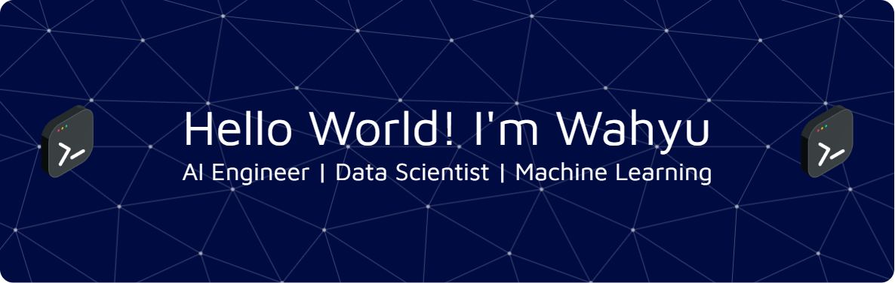

## Hi! Nice to see you. 👋

Welcome to my page! I'm Wahyu Widihansyah, an AI Engineer & Data Scientist based in Sidoarjo, Indonesia.
Bridging the gap between complex data, advanced machine learning models, and production-ready AI solutions.

# 👨‍💻 About Me:
Driven AI Engineer & Data Scientist passionate about architecting, training, and deploying intelligent data-driven systems. Focused on end-to-end Machine Learning pipelines, Deep Learning architectures, Natural Language Processing (NLP), Computer Vision, and modern MLOps practices.

 🔭 Current Focus: Building robust ML pipelines, fine-tuning GenAI/LLM models, and creating scalable AI microservices. 🧠 Core Expertise: Predictive Modeling, Deep Learning, Statistical Analysis, NLP, Computer Vision, & AI System Architecture.
 ⚙️ Production & MLOps: Model deployment via FastAPI/REST APIs, Docker containerization, experiment tracking, and ML workflow orchestration.
 🌱 Continuously Exploring: MLOps, ML/DL for Industry, Retrieval-Augmented Generation (RAG), Agentic AI Systems, & Vector Databases.
 💬 Ask Me About: PyTorch, TensorFlow, Scikit-Learn, MLOps best practices, Data Engineering, and Model Optimization.
 ⚡ Fun Fact: Data is raw material, sound statistics, and clean software engineering transform it into real-world intelligence!
 📬 How to reach me: wahyuwidihansyah@gmail.com | Pronouns: He/Him/His 

## 🌐 Socials:
   

# 💻 Tech Stack:
                                                                                                

### ✍️ Random Dev Quote

Play Game with me!

###

###

<picture data-importer="pacman">
  <source media="(prefers-color-scheme: dark)" srcset="https://raw.githubusercontent.com/waahyoew/waahyoew/pacman-output/pacman-contribution-graph-dark.svg?game=pacman">
  <source media="(prefers-color-scheme: light)" srcset="https://raw.githubusercontent.com/waahyoew/waahyoew/pacman-output/pacman-contribution-graph.svg?game=pacman">
  
</picture>

###